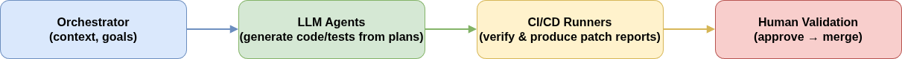

# LLMForge Protocol

### Abstract

LLMForge is an ongoing research effort exploring how artificial intelligence  
can participate safely and transparently in software engineering workflows.

It introduces a conceptual framework for supervised AI-assisted software development.  
The protocol formalizes how language models, CI/CD pipelines and human validation  
can cooperate under a shared versioned structure.

---

### Vision

LLMForge explores a new way for artificial intelligence and developers to collaborate.

Instead of treating language models as black-box code generators,  
LLMForge defines a disciplined environment where every task is described,  
versioned, and verified.

It is not a tool or a framework,  
but a **philosophy of supervised AI development** —  
where creativity remains human and precision becomes shared.

---

### Core Principles

- Every action is traceable.  
- Automation never replaces validation.  
- Human review remains the final authority.  
- Structure enables creativity, not the opposite.

---

### Concept Overview

The LLMForge protocol defines a common structure for  
**issues**, **plans**, **validation**, and **collaboration**  
between humans and AI agents.  
This structure aligns with modern DevOps practices while remaining model-agnostic.

---

### Purpose

The goal of LLMForge is to establish a shared language  
between humans, large language models, and development pipelines.

No implementation details or internal scripts are published here.  
This repository serves purely as a **conceptual and philosophical reference**  
for the research community.

---

### Contact

For collaboration or academic inquiries, please reach out via  
**GitHub Discussions** or your preferred professional channel.

---

**Created as part of the LLMForge project — 2025**  
**License:** Creative Commons BY-NC-ND 4.0  
